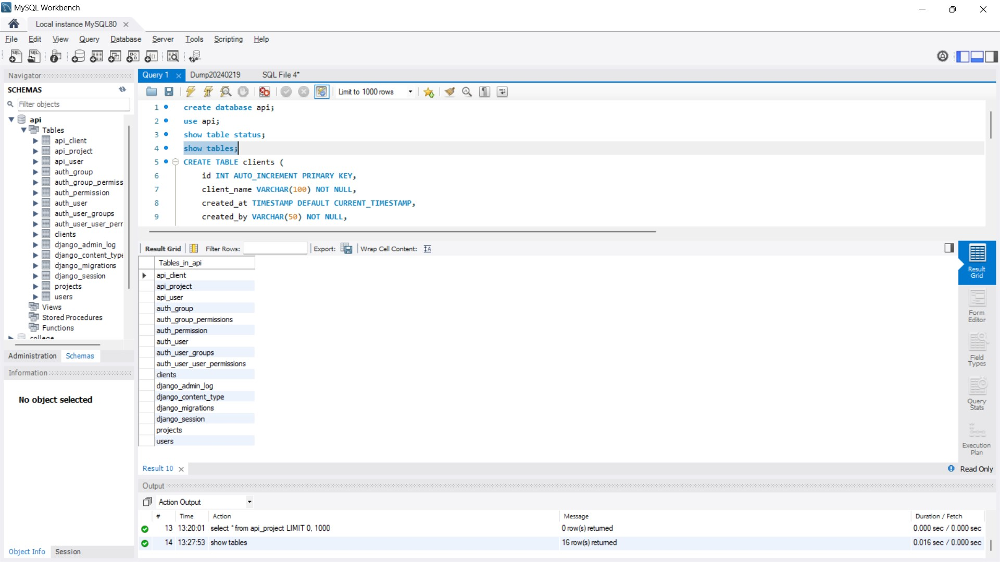

# 🌟 Django API with MySQL

Welcome to the **Django API** project! 🚀 This project demonstrates how to create a RESTful API using Django and connect it to a MySQL database. It's designed for developers looking to build efficient and scalable applications.

## 📦 Features

- **RESTful API**: Follow the principles of REST to create a clean and efficient API.
- **MySQL Integration**: Seamlessly connect and interact with a MySQL database.
- **Django Rest Framework**: Utilize DRF for easy serialization and view management.
- **CRUD Operations**: Create, Read, Update, and Delete resources effortlessly.
- **User Authentication**: Secure your API with user authentication and permissions.

## ⚙️ Getting Started

### Prerequisites

Make sure you have the following installed on your machine:

- Python (3.8 or higher) 🐍
- Django (3.0 or higher) 🌐
- MySQL Server 💽
- pip (Python package manager) 📦

### Installation

1. **Clone the Repository**:

   ```bash
   git clone https://github.com/vinitpol/Django_api.git
   cd django-api-mysql
   ```

2. **Create a Virtual Environment**:

   
   python -m venv venv
   source venv/bin/activate  # On Windows use `venv\Scripts\activate`
   

3. **Install Requirements**:

   
   pip install -r requirements.txt
   

4. **Configure MySQL Database**:

   - Create a new MySQL database for your project.
   - Update the `DATABASES` setting in `settings.py`:

   ```python
   DATABASES = {
       'default': {
           'ENGINE': 'django.db.backends.mysql',
           'NAME': 'your_database_name',
           'USER': 'your_username',
           'PASSWORD': 'your_password',
           'HOST': 'localhost',
           'PORT': '3306',
       }
   }
   ```

5. **Run Migrations**:

   
   python manage.py migrate
   

6. **Start the Development Server**:

   
   python manage.py runserver
   

7. **Access the API**: Open your browser and navigate to `http://127.0.0.1:8000/api/v1/client/` to see the API in action! 🌐

## 📖 API Endpoints

| Method | Endpoint                     | Description                |
|--------|------------------------------|----------------------------|
| GET    | `/api/v1/client/`           | Retrieve a list of clients |
| POST   | `/api/v1/client/`           | Create a new client        |
| GET    | `/api/v1/client/{id}/`       | Retrieve a specific client  |
| PUT    | `/api/v1/client/{id}/`       | Update a specific client    |
| DELETE | `/api/v1/client/{id}/`       | Delete a specific client    |

## 🧪 Testing

To run tests, execute the following command:


python manage.py test


## 🤝 Contributing

Contributions are welcome! If you have suggestions for improvements or new features, please create an issue or submit a pull request. 🌈

## 📄 License

This project is licensed under the MIT License. See the [LICENSE](LICENSE) file for details.

## 📬 Contact

For any questions, feel free to reach out at [vinitpol2000@gmail.com] or open an issue in the repository. ✉️

## 📸 Screenshot




!## Django API Project 🌟